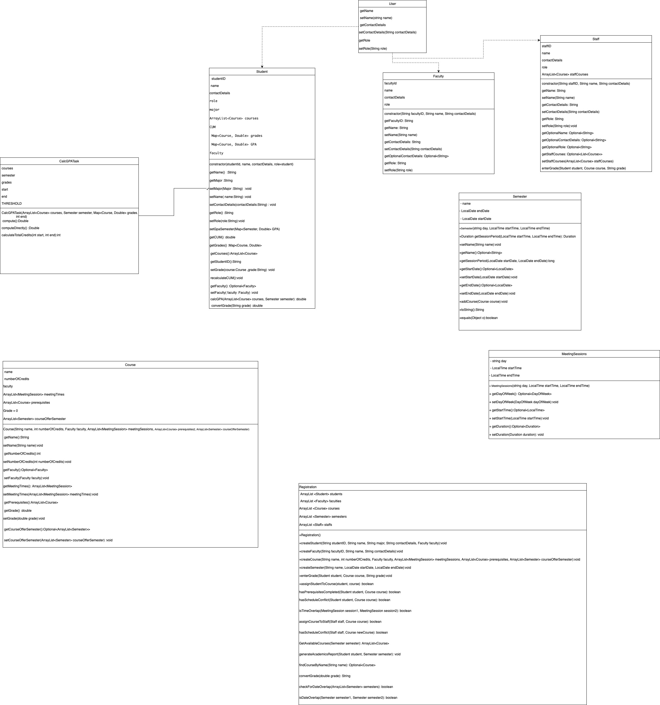

# University Registration System

## Overview

The University Registration System is a Java-based application designed to manage course registrations, class schedules, and student enrolments at a university. This system leverages Java 8 features to enhance functionality and performance.

## System Requirements

- Java Runtime Environment (JRE) 8 or higher
- Access to course, faculty, student, and semester data files in specified formats

## Features

- **Course Registration**: Allows the registrar to create, view, and manage courses.
- **Class Scheduling**: Facilitates scheduling classes without conflicts.
- **Student and Faculty Management**: Supports creating and managing student and faculty profiles.
- **Report Generation**: Enables generation of academic and administrative reports.

## Schema


## Installation

1. Clone the repository from GitHub using the provided link.
2. Navigate to the project directory.
3. Compile the Java source files using Maven:
   ```
   mvn clean install
   ```

## Usage

- To run the application, use the following command in the terminal:
  ```
  java -jar target/uni_project-1.0-SNAPSHOT.jar
  ```
- Follow the on-screen prompts to interact with the system.

## Class Descriptions

### Course

- Manages course details including name, credits, faculty, and meeting times.
- Utilizes `Optional` and Java 8 Date/Time API.
- Use thread safety

### Faculty

- Represents faculty members with attributes like ID, name, and contact details.
- Implements the `User` interface.
- Use thread safety

### MeetingSession

- Manages individual class meeting sessions, using Java 8 Date/Time API.
- Use thread safety

### Registration

- Central class for registration operations.
- Implements thread safety for concurrent data access.
- Use thread safety

### Student

- Represents students, handling courses, grades, and GPA calculations.
- Demonstrates parallel computing in GPA calculation.
- Use thread safety

### Semester

- Represents academic semesters, managing related courses and dates.
- Use thread safety

## Testing

- Comprehensive unit tests using JUnit.
- Covers key functionalities like course creation, student registration, and conflict checks.

## Documentation

- In-code comments and Javadoc are used throughout the project to explain the functionality and usage of classes and methods.
- Javadoc comments can be generated into HTML documentation using the following Maven command:
  ```
  mvn javadoc:javadoc
  ```

## Authors

- **Bakeza Diazada**
- **Saja Lahalih**
- **Sara Sulibe**

## Acknowledgments

This project makes use of the following open-source libraries and resources:

- **JUnit**: For unit testing our application. Thanks to the JUnit team for maintaining this invaluable testing framework.
- **Maven**: For managing project dependencies and build lifecycle. Appreciation goes to the Apache Maven Project.

Special thanks to all the contributors to these projects for their hard work and dedication to the open-source community.
